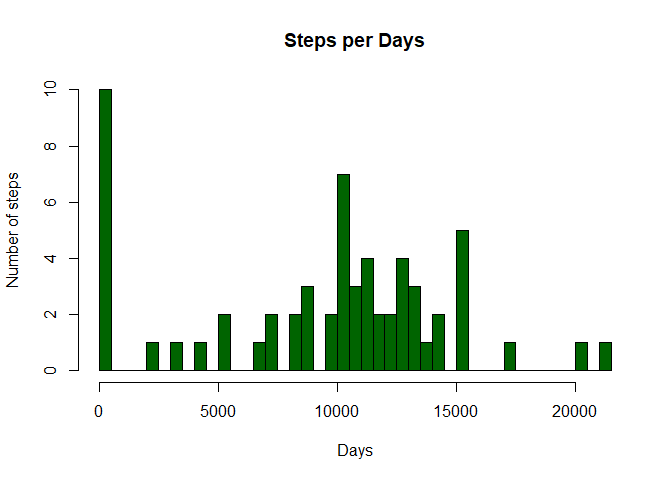
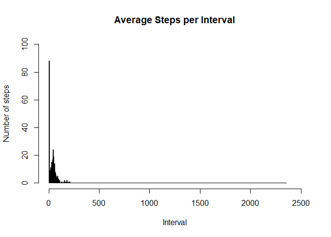
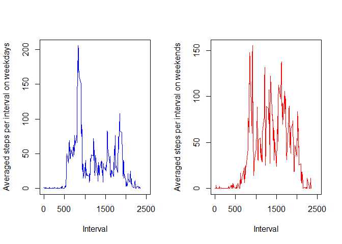

This repository is created for the first assignment of the "Reproducible Research" course by John Hopkins University on Coursera.

## Introduction

It is now possible to collect a large amount of data about personal movement using activity monitoring devices such as a Fitbit, Nike Fuelband, or Jawbone Up. These type of devices are part of the “quantified self” movement – a group of enthusiasts who take measurements about themselves regularly to improve their health, to find patterns in their behavior, or because they are tech geeks. But these data remain under-utilized both because the raw data are hard to obtain and there is a lack of statistical methods and software for processing and interpreting the data.

This assignment makes use of data from a personal activity monitoring device. This device collects data at 5 minute intervals through out the day. The data consists of two months of data from an anonymous individual collected during the months of October and November, 2012 and include the number of steps taken in 5 minute intervals each day.

The data for this assignment can be downloaded from the course web site:
https://d396qusza40orc.cloudfront.net/repdata%2Fdata%2Factivity.zip

The variables included in this dataset are:

    * steps: Number of steps taking in a 5-minute interval (missing values are coded as \color{red}{\verb|NA|}NA)
    * date: The date on which the measurement was taken in YYYY-MM-DD format
    * interval: Identifier for the 5-minute interval in which measurement was taken

The dataset is stored in a comma-separated-value (CSV) file and there are a total of 17,568 observations in this dataset.

## Including libraries

```r
library(dplyr)
```

```
## Warning: package 'dplyr' was built under R version 4.0.5
```

```
## 
## Attaching package: 'dplyr'
```

```
## The following objects are masked from 'package:stats':
## 
##     filter, lag
```

```
## The following objects are masked from 'package:base':
## 
##     intersect, setdiff, setequal, union
```

## Loading and preprocessing the data


```r
#Checks if the data file exists in the working directory
if (!file.exists("activity.csv")) {
  filename = "Activity monitoring data.zip"
  
  #Checks if the zipped data file exists in the working directory
  if(file.exists(filename)) file.remove(filename)
  
  #Downloads and extracts the data
  data_url = "https://d396qusza40orc.cloudfront.net/repdata%2Fdata%2Factivity.zip"
  download.file(data_url, filename)
  unzip(filename)
  
  #Remove zip file as it's not needed anymore
  file.remove(filename)
}

#Read the data
data <- read.csv("activity.csv", header=TRUE)
```

## What is mean total number of steps taken per day?

1. Calculate the total number of steps taken per day.

```r
steps_per_day<-data %>%
  group_by(date) %>%
  summarize(sum = sum(steps, na.rm=TRUE))
```

2. If you do not understand the difference between a histogram and a barplot, research the difference between them. Make a histogram of the total number of steps taken each day.

```r
hist(steps_per_day$sum, breaks = length(steps_per_day$sum), col='dark green',
     xlab = 'Days', ylab = 'Number of steps', main = 'Steps per Days')
```

<!-- -->

3. Calculate and report the mean and median of the total number of steps taken per day.

```r
mean(steps_per_day$sum)
```

```
## [1] 9354.23
```

```r
median(steps_per_day$sum)
```

```
## [1] 10395
```

## What is the average daily activity pattern?

1. Make a time series plot (i.e. \color{red}{\verb|type = "l"|}type = "l") of the 5-minute interval (x-axis) and the average number of steps taken, averaged across all days (y-axis).

```r
#Creating dataframe of average steps for each interval
steps_per_interval<-data %>%
  group_by(interval) %>%
  summarize(mean = mean(steps, na.rm=TRUE))

hist(steps_per_interval$mean, breaks = seq(0, 2355, by=5),
     xlab = 'Interval', ylab = 'Number of steps', 
     main = 'Average Steps per Interval', xlim = c(0, 2500), 
     ylim = c(0, 100))
```

<!-- -->

2. Which 5-minute interval, on average across all the days in the dataset, contains the maximum number of steps?

```r
max_interval = steps_per_interval[which(steps_per_interval$mean==max(steps_per_interval$mean)),]
max_interval
```

```
## # A tibble: 1 x 2
##   interval  mean
##      <int> <dbl>
## 1      835  206.
```

## Imputing missing values

1. Calculate and report the total number of missing values in the dataset (i.e. the total number of rows with \color{red}{\verb|NA|}NAs).

```r
missing_num<-sum(is.na(data))
missing_num
```

```
## [1] 2304
```

2. Devise a strategy for filling in all of the missing values in the dataset. The strategy does not need to be sophisticated. For example, you could use the mean/median for that day, or the mean for that 5-minute interval, etc.
3. Create a new dataset that is equal to the original dataset but with the missing data filled in.

```r
#Checking which columns have missing values
sapply(data, function(x) sum(is.na(x)))
```

```
##    steps     date interval 
##     2304        0        0
```

```r
#Looking for a median in each interval
median_per_interval<-data %>%
  group_by(interval) %>%
  summarize(median = median(steps, na.rm=TRUE))

#Replace with local median
data_without_na<-data
for(i in 1:nrow(data)) {        
  if(is.na(data[i,'steps'])){
    data_without_na[i,'steps']<-median_per_interval$median[median_per_interval$interval==data[i, 'interval']]
  } 
}

#Check for NA's
sapply(data_without_na, function(x) sum(is.na(x)))
```

```
##    steps     date interval 
##        0        0        0
```

4. Make a histogram of the total number of steps taken each day and Calculate and report the mean and median total number of steps taken per day. Do these values differ from the estimates from the first part of the assignment? What is the impact of imputing missing data on the estimates of the total daily number of steps?

```r
steps_per_day_new<-data_without_na %>%
  group_by(date) %>%
  summarize(sum = sum(steps, na.rm=TRUE))

par(mfrow=c(1,2))
hist(steps_per_day$sum, breaks = length(steps_per_day$sum), col='dark green',
     xlab = 'Days', ylab = 'Number of steps', main = 'Steps per days with NAs', xlim = c(0, 25000))
hist(steps_per_day_new$sum, breaks = length(steps_per_day_new$sum), col='dark green',
     xlab = 'Days', ylab = 'Number of steps', main = 'Steps per days without NAs', xlim = c(0, 20000))
```

<!-- -->

Values are spread a bit more equally but the difference is rather negligible.

## Are there differences in activity patterns between weekdays and weekends?

1. Create a new factor variable in the dataset with two levels – “weekday” and “weekend” indicating whether a given date is a weekday or weekend day.

```r
#Create column indication which day of week it is
data_without_na$date= as.Date(data_without_na$date, format = "%Y-%m-%d")
data_without_na$Weekday = weekdays(data_without_na$date)

#Create the factor variable
data_without_na$DayType <- ifelse(grepl(pattern = "Monday|Tuesday|Wednesday|Thursday|Friday", x = data_without_na$Weekday), "Weekday", 'Weekend')
data_without_na$DayType <- as.factor(data_without_na$DayType)

#Checking
str(data_without_na)
```

```
## 'data.frame':	17568 obs. of  5 variables:
##  $ steps   : int  0 0 0 0 0 0 0 0 0 0 ...
##  $ date    : Date, format: "2012-10-01" "2012-10-01" ...
##  $ interval: int  0 5 10 15 20 25 30 35 40 45 ...
##  $ Weekday : chr  "Monday" "Monday" "Monday" "Monday" ...
##  $ DayType : Factor w/ 2 levels "Weekday","Weekend": 1 1 1 1 1 1 1 1 1 1 ...
```

```r
head(data_without_na, 10)
```

```
##    steps       date interval Weekday DayType
## 1      0 2012-10-01        0  Monday Weekday
## 2      0 2012-10-01        5  Monday Weekday
## 3      0 2012-10-01       10  Monday Weekday
## 4      0 2012-10-01       15  Monday Weekday
## 5      0 2012-10-01       20  Monday Weekday
## 6      0 2012-10-01       25  Monday Weekday
## 7      0 2012-10-01       30  Monday Weekday
## 8      0 2012-10-01       35  Monday Weekday
## 9      0 2012-10-01       40  Monday Weekday
## 10     0 2012-10-01       45  Monday Weekday
```

2. Make a panel plot containing a time series plot (i.e. \color{red}{\verb|type = "l"|}type = "l") of the 5-minute interval (x-axis) and the average number of steps taken, averaged across all weekday days or weekend days (y-axis). See the README file in the GitHub repository to see an example of what this plot should look like using simulated data.

```r
#Finding separate means for weekday and weekends per interval
steps_per_interval_by_daytype<-data_without_na %>%
  group_by(interval) %>%
  summarize(mean_weekday = mean(steps[DayType=='Weekday'], na.rm=TRUE), mean_weekend = mean(steps[DayType=='Weekend'], na.rm=TRUE))
steps_per_interval_by_daytype
```

```
## # A tibble: 288 x 3
##    interval mean_weekday mean_weekend
##       <int>        <dbl>        <dbl>
##  1        0       2.02          0    
##  2        5       0.4           0    
##  3       10       0.156         0    
##  4       15       0.178         0    
##  5       20       0.0889        0    
##  6       25       1.31          3.25 
##  7       30       0.622         0    
##  8       35       1.02          0    
##  9       40       0             0    
## 10       45       1.6           0.375
## # ... with 278 more rows
```

```r
#Write the plot into the file
par(mfrow=c(1,2))
plot(x = steps_per_interval_by_daytype$interval, y = steps_per_interval_by_daytype$mean_weekday, type="l", xlab="Interval", 
     ylab="Averaged steps per interval on weekdays", xlim = c(0, 2500), col='blue')
plot(x = steps_per_interval_by_daytype$interval, y = steps_per_interval_by_daytype$mean_weekend, type="l", xlab="Interval", 
     ylab="Averaged steps per interval on weekends", xlim = c(0, 2500), col='red')
```

<!-- -->
